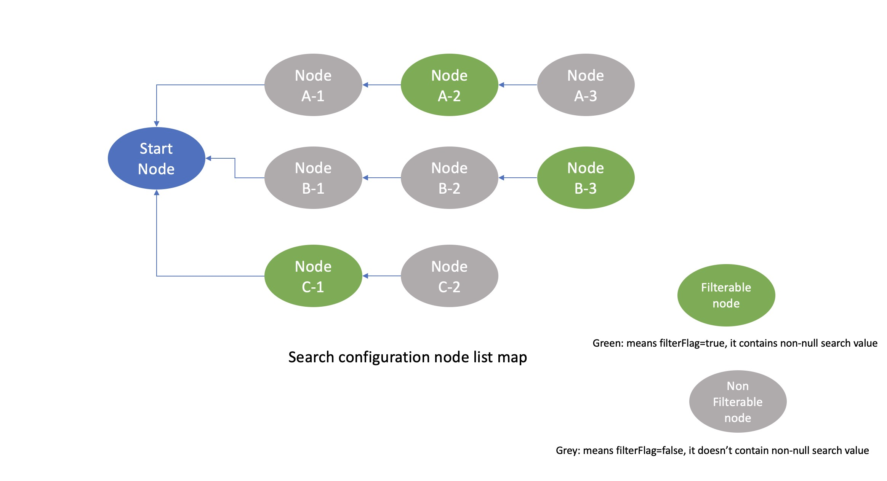
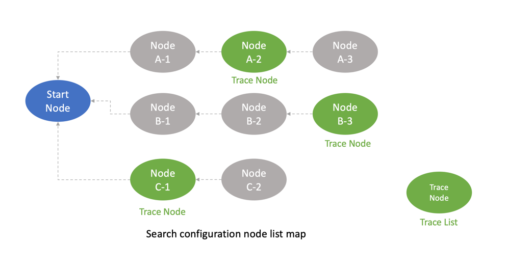
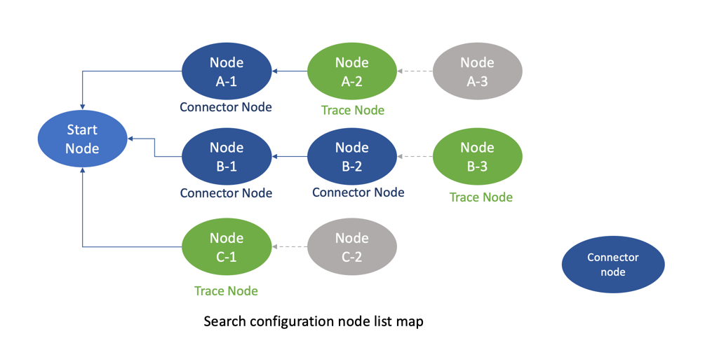

# BSearchService

`BSearchService` is the central service class for executing searches. This class generates SQL commands based on the provided search context and search node configurations.

### Search Process
The client initiates a search by calling the `doSearchWithContext` method with the search context. This is the main entry point for executing a search.

#### Register Non-Null Search Fields
The service traverses all the fields in the search model reflectively, checking for fields that have non-null values. If a field has a non-null value, it is registered to the corresponding search node configuration, and the property 'filterFlag' is set to true for this search node configuration.

#### Generate the Raw SQL Command
The service generates the raw SQL command for each search node configuration.

#### Generate the Trace List
Using an internal method:`generateTraceList`, to generate a `Trace list`. This list contains the final search node configurations with non-null search values. 
If no nodes contain non-null values, the trace list contains only the `start node`.

#### Connect the Trace List to the Start Node
The trace list is filled with `connectors`: search node configuration lists that allow navigation from each `Trace node` (the last filterable node) to the `start node`.

#### Generate the Final SQL Command
The service generates the final SQL command using the `trace list`, which includes the `connectors` nodes.

## Method:doSearchWithContext
This public method is the main API method to executes a search based on the provided search context and a list of search node configurations,
and returns the search response.

## Method:genSQLCommandCore
This internal method provide the logic to generate the SQL command for executing a search by inputting search context information and list of search node configuration.

## Method:generateTraceList
Generate the `Trace node` and `Trace list` by calculating each search node configuration with non-null search values.