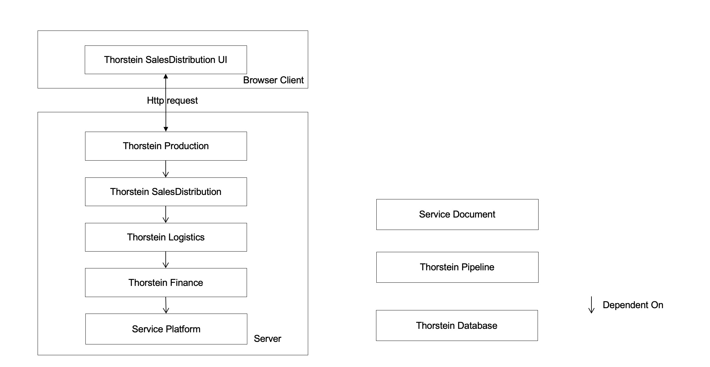

## Design Document

The product is designed as a Browser/Server (B/S) software product. On the server side, it comprises several interconnected Java projects/modules housed within a vertical framework, each focusing on a unique functional or business area.
Here's a brief introduction to these Java modules on the server side:

 

## Design Document

## Modules on the server side:
### [Service Platform](https://github.com/harryzonennov/IntelligentPlatform)
This is the foundational module of the product offers platform technology, such as the framework. It also supports cross-business functions,
like Material, Logon User, Customer, and Organization Management. 

For detailed design information about `Platform` and the `Document`, please refer to the following document:

- [Platform Document](platform/foundation/document/README.md)

For detailed design information about UI client side, please refer to the following document:
- [UI Client Document](uiClient/README.md)

