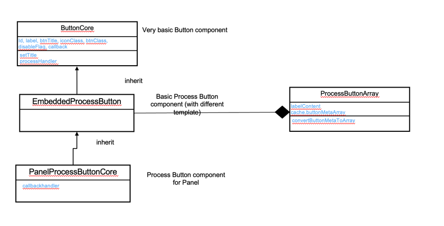

# Overview

This article provides a detailed explanation of the design and rendering of the `Process Button`, which appears on standard pages or panels. 
The `Process Button` is located in the header area of a page or panel and serves to initiate actions such as `SAVE`, `EXIT`, or other standard document or functional actions like `Confirm`.

## Design and Structure

1. **`ProcessButtonArea`**
   The `ProcessButtonArea` is a Vue component responsible for managing arrays of `Process Buttons` within the header area of a page. It can represent multiple instances of `Process Button`.

2. **`Process Button`**
   Different Sub Vue components are responsible for rendering and controlling the `Process Button` depending on its location:

- On a standard page, the `Process Button` is managed by the Vue component `EmbeddedProcessButton`.
- On a bottom panel, the `Process Button` is managed by the Vue component `PanelProcessButtonCore`.

Both `EmbeddedProcessButton` and `PanelProcessButtonCore` inherit from the parent Vue component `ButtonCore`. 
`ButtonCore` provides fundamental functions and attributes for buttons, such as setting the label and panel, and handling callback functions.

## Workflow
This section outlines the rendering process of the `Process Button` using key methods within the `ProcessButtonArray` class.

1. **Entrance API method:`convertButtonMetaToArray`**
- **Overview**:This Entrance API method transforms button metadata into an array format for rendering. 
This method is typically invoked by a page controller class to prepare the `Process Button` metadata array.
- **Preparing the variable**: The method begins by preparing data for converting button metadata. The `processButtonMetaArray` is retrieved from input parameters provided by the parent controller. If no input is provided, the metadata is obtained from the Vue component's class attribute, processButtonMetaArray.
- The variable `labelObject` is provided by the parent controller as a customized button label object.
- The variable `labelContent` is sourced from the Vue component class data as a default button label object.
- **Core Prepare Button Metadata Logic:** The method `ProcessButtonArray.convertButtonMetaToArray` is called to perform the core logic of converting the button metadata array for rendering.
- **Metadata for button rendering:** The converted button metadata array is stored in the Vue component class data `vm.cache.buttonMetaArray`, which is directly used for rendering the `Process Button`.
- **Process Button Group**: Similarly, `vm.cache.buttonGroupArray` serves as the output for process button group rendering from `ProcessButtonArray.convertButtonGroupArray`.

2. **ProcessButtonArray.convertButtonMetaToArray**
- **Overview**: This method iterates through and processes each Button Meta within the `buttonMetaArray`.
- **Process Standard Button**: For standard buttons, it invokes `ProcessButtonArray.convertButtonMetaCore` to carry out the core conversion logic for each standard button, to integrate the button standard properties.
- **Process Standard Document Action Button**: In case for `PLACEHOLDER`, especially for the standard document action button, 
  it calls `ProcessButtonArray.genDocActionProcessButtonMeta` to generate standard document button metadata: such as the standard document callback function, button `formatClass` attributes,  and then apply button conversion logic to integrate the button standard properties.

3. **ProcessButtonArray.genDocActionProcessButtonMeta**
- **Overview**: This function is responsible for generating standard document button metadata by utilizing the `actionCodeList` and `actionCodeMatrix`. Here's how it works:

- It iterates over each document action code to produce button metadata for each individual action.
- **Button `formatClass` attributes**: For each button, it provides properties by invoking `ProcessButtonArray.generateDefDocFormatClass` to define the button's `formatClass` property.
- **Document Action Callback**:Additionally, it establishes button properties by calling `ProcessButtonArray.generateDefDocActionCallback`, which sets up the callback function needed for executing document actions.
- **Standard Button standard properties**:Lastly, the function utilizes `ProcessButtonArray.convertButtonMetaCore` to apply essential conversion logic to each button metadata.

Overall, this function streamlines the creation of document button metadata by generating essential properties and functionalities for each action code.

4. **ProcessButtonArray.convertButtonMetaCore**
- This method is fundamentally responsible for integrating standard button properties, including `label`, `btnTitle`, and `iconClass`.
- The `iconClass` property is derived using `actionCode`.
- The `label` property is initially retrieved using the `button.id` as the key from the `labelObject`, which is custom-defined in the parent Vue controller. If not available, it defaults to label definitions within the component (`labelContent`).
- The `btnTitle` property is similarly accessed using `button.btnTitle` as the key from the `labelObject`, defaulting to definitions within `labelContent` if unavailable.

5. **Convert Button Group**
- **Overview**: This method: `convertButtonGroupArray` is responsible for processing the button group.
- **Rendering the Button Group header**: For processing each button group, calling method `convertButtonItem` to apply for the button properties for group button header.
- **Iterating through Button Group Items**: For each item in a button group, the method iterates through each button item and calls convertButtonItem to apply button properties to each group button item.
- **Core Conversion Logic**:Within the `convertButtonItem` method, the main logic utilizes `ProcessButtonArray.convertButtonMetaCore` to apply essential conversion logic to each button's metadata.

## FAQ

### How are the bottom panel buttons (`save` and `navToEdit`) rendered?

#### **Answer: Workflow Overview**

1. **High-Level Workflow**  
   - Generally speaking, the buttons embedded in the bottom panel are generated and rendered during the `postUpdate` phase. This phase is executed once the data has been loaded in the front-end controller.

2. **Triggering `postUpdate` in the `ItemController`**  
   - The `postUpdate` phase is initiated by the front-end controller: `ServiceItemController`. Specifically, it is triggered via the method `ServiceItemController->postUpdateUIModel`.  
   - This method is invoked for each panel controller after data is successfully loaded. Within `postUpdateUIModel`, the method `getPageRef().postUpdate()` is called.  
   - Based on the `corePage` definition in the template of the `ServiceItemController`, the `getPageRef` method returns an instance of the `async-editor-control`. Consequently, the `AsyncPage.postUpdate` method is executed.

3. **Sequential `postUpdate` Calls Across Vue Components**  
   - The `postUpdate` method is defined and executed sequentially in various types of control and component classes in the front end:
     - The `AsyncPage.postUpdate` method is first invoked.  
     - Next, the `AsyncEditSection.postUpdate` method is triggered by the parent component.  
     - Inside the `AsyncEditSection` template, the `portlet-head-ele` component (defined as a subcomponent) relies on the method `getPortletHeadCls` to determine its specific type dynamically at runtime.  
     - Lastly, the `ControlPortletHead.postUpdate` method is called. This method uses the utility function `ServiceVueUtility.batchExecuteSubRefMethod` to invoke the `postUpdate` methods of all child components. //TODO navigate to 

4. **PostUpdate Processing in `PanelProcessButtonArray`**  
   - The `ControlPortletHead` component eventually invokes the `PanelProcessButtonArray.postUpdate` method.  
   - Within this method:  
       1. The default button metadata is generated using `generateButtonMeta`, based on the specific `useCase`.  
       2. The metadata is then processed by the `convertButtonMetaToArray` method. This method integrates standard properties such as `label`, `btnTitle`, and `iconClass` into the button metadata by calling the utility function `ProcessButtonArray.convertButtonMetaToArray`.

### Why is the Sequential `postUpdate` method Sometimes Not Successfully Invoked Across Vue Components?

#### **Answer:**

The sequential `postUpdate` methods, which call methods with the same name in child components, are implemented using the utility method `ServiceVueUtility.batchExecuteSubRefMethod`[Link to ServiceVueUtility.batchExecuteSubRefMethod](AsyncControlDesign.md#servicevueutilitybatchexecutesubrefmethod).

Within this method:
- Child components are identified using Vue's `$refs` attribute.  
- Therefore, two conditions must be met for this mechanism to work correctly:
  1. The child components must be defined within the Vue template.  
  2. **Most importantly**, each child component must have a `ref` property defined.  

If the `ref` property is missing, the child component cannot be identified through Vue’s `$refs` attribute, and as a result, the `postUpdate` method cannot be invoked on that component.
